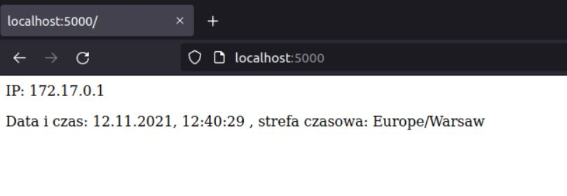

# Sprawozdanie
## Zad 3
a) Aby zbudować opracowany obraz kontenera użyłem polecenia ```docker build -t image_app1 .```

b) Aby uruchomić kontener na podstawie zbudowanego obrazu użyłem polecenia ```docker run -p 5000:8080 -it --rm --name app1 image_app1```

c) Aby uzyskać informacje, które wygenerował serwer, po uruchomieniu kontenera otworzyłem drugi terminal i wpisałem następujace polecenie ```docker logs app1``` 

d) Aby sprawdzić ile warstw posiada zbudowany obraz użyłem polecenia ```docker history image_app1```


## Zad 4

Mozna zbudować obraz wykorzystując bezpośrednio link do Dockerfile. Służy do tego polecenie ```docker build -t name (link do repozytorium na Github)```

Aby przenieść obraz na swoje konto na DockerHub należy podać następujące polecenia: ```docker tag (nazwa obrazu) (nazwa repozytorium)``` i ```docker push (nazwa repozytorium)```
